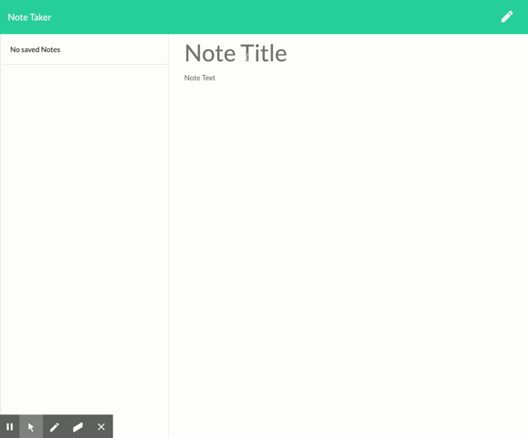

# note-taker

## Table of Contents:
* [Description](#Description)
* [How to Install](#How-to-Install)
* [Usage](#Usage)
* [Contributors](#Contributors)
* [Link to Page](#Link-to-Page)

## Description
This application creates notes using the CRUD method - Create, Read, Update & Delete

## How to Install
run: `npm install` in your terminal/bash, then `node server`
or: click * https://rocky-ocean-82694.herokuapp.com/

## Usage
You would use this application to create notes that are savable, editable and deletable.

## Contributors
* **Karla McLeod** - [kmcleod81](https://github.com/kmcleod81)

## Link to Page
* https://rocky-ocean-82694.herokuapp.com/
